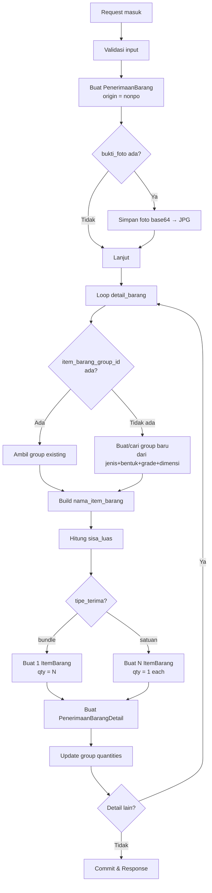
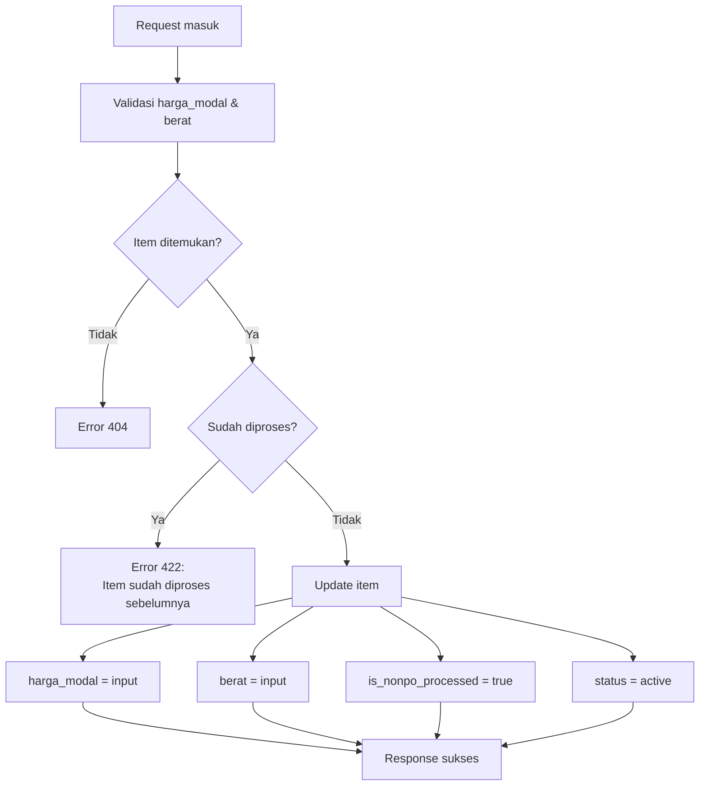
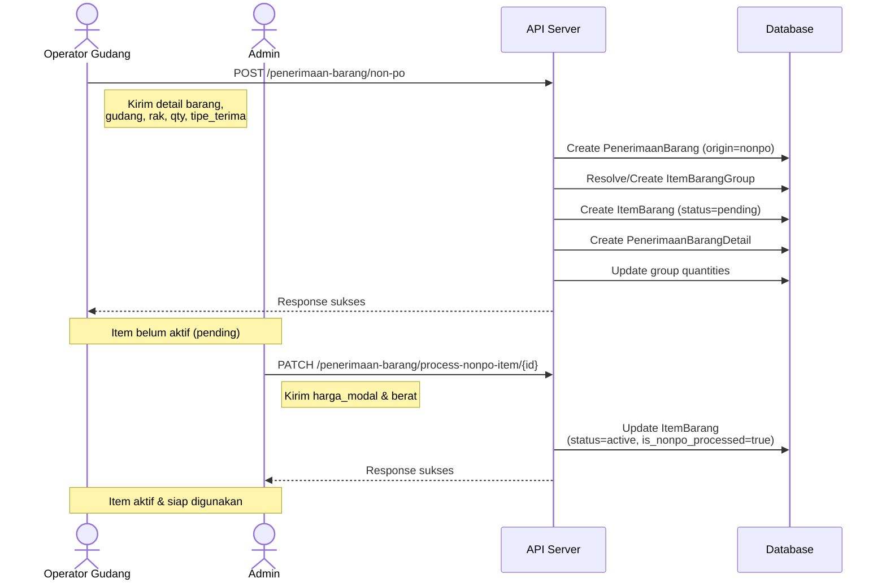

# Dokumentasi Penerimaan Barang Non-PO

## Deskripsi

Fitur **Penerimaan Barang Non-PO** memungkinkan penerimaan barang ke gudang tanpa memerlukan referensi Purchase Order (PO) atau Stock Mutation. Proses ini terdiri dari 2 tahap:

1. **Store Non-PO** — Membuat data penerimaan barang beserta item-item baru
2. **Process Non-PO Item** — Admin mengisi harga modal dan berat, mengaktifkan item

---

## Database Migration

Migration `2026_02_22_145529_add_harga_modal_and_nonpo_processed_to_item_barang_table.php` menambahkan 2 kolom pada tabel `ref_item_barang`:

| Kolom | Tipe | Default | Keterangan |
|---|---|---|---|
| `harga_modal` | `decimal(15,2)` | `NULL` | Harga modal barang (diisi saat proses) |
| `is_nonpo_processed` | `boolean` | `false` | Penanda item sudah diproses admin |

---

## Item Barang Status (Enum)

```php
enum ItemBarangStatus: string
{
    case ACTIVE  = 'active';   // Barang aktif, siap digunakan
    case DESTROY = 'destroy';  // Barang dihancurkan
    case PENDING = 'pending';  // Menunggu proses (status awal Non-PO)
}
```

### Alur Status Non-PO:
```
[storeNonPo] → status: "pending", is_nonpo_processed: false
      ↓
[processNonPoItem] → status: "active", is_nonpo_processed: true
```

---

## API Endpoints

Base URL: `/api/penerimaan-barang`  
Middleware: `checkrole`

### 1. Store Penerimaan Barang Non-PO

```
POST /api/penerimaan-barang/non-po
```

**Deskripsi:** Membuat data penerimaan barang baru dari sumber Non-PO. Secara otomatis membuat record `ItemBarang` baru dan `ItemBarangGroup` (jika belum ada).

#### Request Body

```json
{
  "gudang_id": 1,
  "catatan": "Penerimaan barang dari supplier lama",
  "bukti_foto": "<base64_encoded_image_string>",
  "detail_barang": [
    {
      "item_barang_group_id": 5,
      "qty": 10,
      "tipe_terima": "bundle",
      "id_rak": 3
    },
    {
      "item_barang_group_id": null,
      "jenis_barang_id": 1,
      "bentuk_barang_id": 2,
      "grade_barang_id": 1,
      "panjang": 6000,
      "lebar": 1500,
      "tebal": 10,
      "qty": 5,
      "tipe_terima": "satuan",
      "id_rak": 4
    }
  ]
}
```

#### Parameter Detail

| Field | Tipe | Wajib | Keterangan |
|---|---|---|---|
| `gudang_id` | integer | ✅ | ID gudang tujuan penerimaan |
| `catatan` | string | ❌ | Catatan penerimaan |
| `bukti_foto` | string | ❌ | Foto bukti penerimaan (base64) |
| `detail_barang` | array | ✅ | Minimal 1 item |

#### Parameter Detail Barang (per item)

| Field | Tipe | Wajib | Keterangan |
|---|---|---|---|
| `item_barang_group_id` | integer | ❌ | ID group yang sudah ada. Jika `null`, group baru dibuat otomatis |
| `jenis_barang_id` | integer | Wajib jika `item_barang_group_id` = null | ID jenis barang |
| `bentuk_barang_id` | integer | Wajib jika `item_barang_group_id` = null | ID bentuk barang |
| `grade_barang_id` | integer | Wajib jika `item_barang_group_id` = null | ID grade barang |
| `panjang` | numeric | ❌ | Dimensi panjang (mm) |
| `lebar` | numeric | ❌ | Dimensi lebar (mm) |
| `tebal` | numeric | ❌ | Dimensi tebal (mm) |
| `diameter_luar` | numeric | ❌ | Diameter luar (mm) |
| `diameter_dalam` | numeric | ❌ | Diameter dalam (mm) |
| `diameter` | numeric | ❌ | Diameter (mm) |
| `sisi1` | numeric | ❌ | Sisi 1 (mm) |
| `sisi2` | numeric | ❌ | Sisi 2 (mm) |
| `qty` | integer | ✅ | Jumlah barang (minimal 1) |
| `tipe_terima` | string | ✅ | `"bundle"` atau `"satuan"` |
| `id_rak` | integer | ✅ | ID rak tempat penyimpanan |

#### Logika `tipe_terima`

| Tipe | Jumlah ItemBarang Dibuat | Quantity per Item |
|---|---|---|
| `bundle` | 1 record | qty = N |
| `satuan` | N record | qty = 1 per record |

**Contoh:** `qty = 10`
- `bundle` → 1 ItemBarang dengan `quantity = 10`
- `satuan` → 10 ItemBarang masing-masing `quantity = 1`

#### Proses Internal (storeNonPo)



#### Response Sukses (201)

```json
{
  "success": true,
  "message": "Penerimaan barang Non-PO berhasil ditambahkan",
  "data": {
    "id": 15,
    "origin": "nonpo",
    "id_purchase_order": null,
    "id_stock_mutation": null,
    "id_gudang": 1,
    "catatan": "Penerimaan barang dari supplier lama",
    "url_foto": "penerimaan-barang/15/bukti_foto.jpg",
    "gudang": { "id": 1, "nama": "Gudang Utama" },
    "penerimaan_barang_details": [
      {
        "id": 30,
        "id_penerimaan_barang": 15,
        "id_item_barang": 120,
        "id_rak": 3,
        "qty": 10,
        "item_barang": {
          "id": 120,
          "kode_barang": "PL-SS-A-6000x1500x10-000045",
          "nama_item_barang": "PL-SS-A-6000x1500x10",
          "status": "pending",
          "is_nonpo_processed": false,
          "harga_modal": null,
          "quantity": 10
        },
        "rak": { "id": 3, "kode": "RAK-A01" }
      }
    ]
  }
}
```

> [!IMPORTANT]
> Item yang dibuat melalui `storeNonPo` memiliki `status = "pending"` dan `is_nonpo_processed = false`. Item belum bisa digunakan dalam transaksi lain hingga diproses melalui endpoint `processNonPoItem`.

---

### 2. Process Non-PO Item

```
PATCH /api/penerimaan-barang/process-nonpo-item/{itemBarangId}
```

**Deskripsi:** Admin mengisi harga modal dan berat untuk item Non-PO. Mengubah status item dari `pending` menjadi `active`.

#### Path Parameter

| Parameter | Tipe | Keterangan |
|---|---|---|
| `itemBarangId` | integer | ID item barang yang akan diproses |

#### Request Body

```json
{
  "harga_modal": 150000.00,
  "berat": 25.50
}
```

#### Parameter

| Field | Tipe | Wajib | Keterangan |
|---|---|---|---|
| `harga_modal` | numeric | ✅ | Harga modal per item (Rp) |
| `berat` | numeric | ✅ | Berat item (kg) |

#### Validasi

- Item harus ada di database
- Item belum pernah diproses (`is_nonpo_processed = false`)
- Jika sudah diproses → return error `422`

#### Proses Internal



#### Response Sukses (200)

```json
{
  "success": true,
  "message": "Item barang Non-PO berhasil diproses",
  "data": {
    "id": 120,
    "kode_barang": "PL-SS-A-6000x1500x10-000045",
    "nama_item_barang": "PL-SS-A-6000x1500x10",
    "status": "active",
    "harga_modal": "150000.00",
    "berat": "25.50",
    "is_nonpo_processed": true,
    "jenis_barang": { "id": 1, "kode": "SS", "nama": "Stainless Steel" },
    "bentuk_barang": { "id": 2, "kode": "PL", "nama": "Plat" },
    "grade_barang": { "id": 1, "kode": "A", "nama": "Grade A" },
    "gudang": { "id": 1, "nama": "Gudang Utama" },
    "rak": { "id": 3, "kode": "RAK-A01" }
  }
}
```

#### Error Response

```json
// Item tidak ditemukan (404)
{
  "success": false,
  "message": "Item barang tidak ditemukan"
}

// Item sudah diproses (422)
{
  "success": false,
  "message": "Item barang ini sudah diproses sebelumnya"
}
```

---

## Helper Methods (Internal)

### resolveItemBarangGroup

Menentukan `ItemBarangGroup` yang akan digunakan:
- Jika `item_barang_group_id` diberikan → ambil group existing
- Jika tidak → buat group baru berdasarkan `jenis_barang_id`, `bentuk_barang_id`, `grade_barang_id`, dan dimensi

### findOrCreateGroupNonPo

Mencari group yang cocok berdasarkan kombinasi jenis + bentuk + grade + dimensi. Jika ditemukan group yang soft-deleted, akan di-restore. Jika tidak ada, buat group baru.

### buildNamaItemBarang

Membuat nama item barang otomatis dari relasi bentuk, jenis, grade, dan dimensi group.

**Format:** `{kode_bentuk}-{kode_jenis}-{kode_grade}-{dimensi}`  
**Contoh:** `PL-SS-A-6000x1500x10`

### createItemBarangNonPo

Membuat record `ItemBarang` baru dengan:
- `kode_barang` = `{nama_item_barang}-{sequence_number}` (auto-generated)
- `status` = `pending`
- `is_nonpo_processed` = `false`
- `jenis_potongan` = `utuh`
- `is_available` = `true`
- Dimensi diambil dari group

### updateGroupQuantitiesNonPo

Menghitung ulang `quantity_utuh` dan `quantity_potongan` pada `ItemBarangGroup` berdasarkan item-item yang berstatus `active`.

> [!NOTE]
> Karena item Non-PO baru dibuat dengan status `pending`, quantity group baru akan terupdate setelah item diproses (status berubah ke `active`) melalui mekanisme lain atau trigger.

---

## Alur Lengkap (End-to-End)



---

## File Terkait

| File | Keterangan |
|---|---|
| `app/Http/Controllers/MasterData/PenerimaanBarangController.php` | Controller utama (storeNonPo, processNonPoItem) |
| `app/Models/MasterData/ItemBarang.php` | Model item barang |
| `app/Enums/ItemBarangStatus.php` | Enum status item (active, destroy, pending) |
| `routes/api.php` | Definisi route API |
| `database/migrations/2026_02_22_145529_add_harga_modal_and_nonpo_processed_to_item_barang_table.php` | Migration tambah kolom harga_modal dan is_nonpo_processed |
